# Fessの実験用環境


# Webのクローリング

# Gitbucketのクローリング

## 基本操作

### <u>起動</u>
```
host> docker-compose -f docker-compose.yml -f docker-compose.gitbucket.yml up -d --build
```

### <u>停止</u>
```
host> docker-compose -f docker-compose.yml -f docker-compose.gitbucket.yml down
```

### <u>状態確認</u>
```
host> docker-compose -f docker-compose.yml -f docker-compose.gitbucket.yml ps 
```

## 設定(Gitbucket側)
"localhost:28080"のURLにブラウザでアクセスして管理者(root)としてログインしてください。<br>
DockerのGitbucketであれば、初期パスワードは"root"となっています。<br>
<br>
<!-- 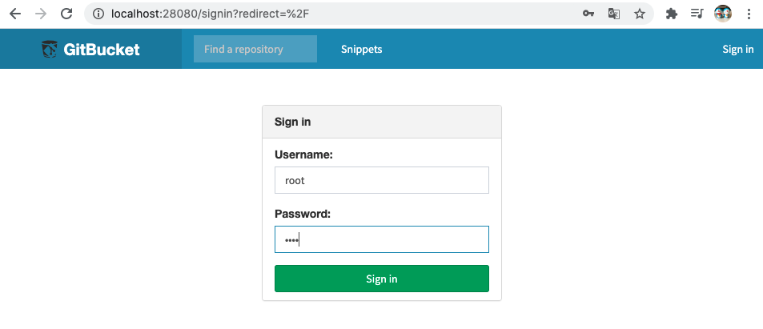 -->


### <u>Fess関連のプラグインをインストール</u>
[ここ](https://mvnrepository.com/artifact/org.codelibs.gitbucket/gitbucket-fess-plugin_2.13/1.7.0)からgitbucket-fess-plugin_2.13-1.7.0.jarをダウンロードして./contents/gitbucket_volume/plugins/にコピーしてください。<br>
コピーしたらGitbucketの管理画面からプラグインをリロードしてください。<br>
<br>
<!-- 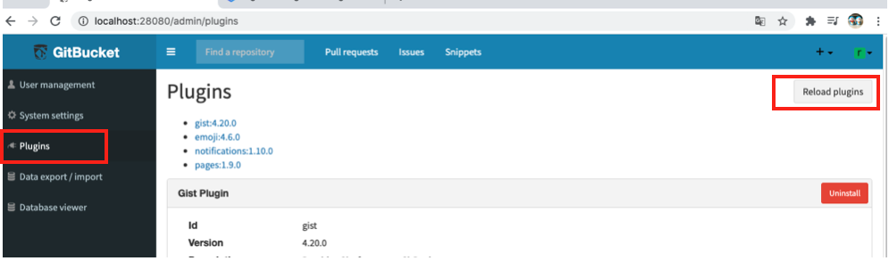 -->

<br>
正常にロードできたら新しい項目が追加されます。<br>

<!-- 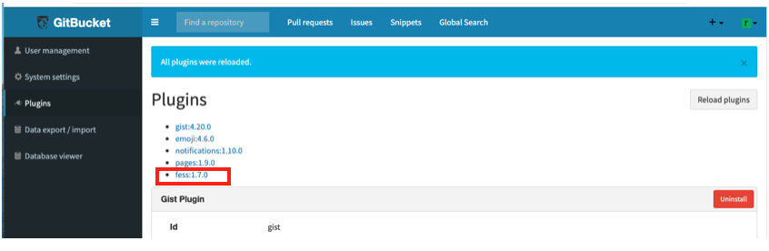 -->


### <u>トークンの発行</u>
FessからGitbucketにアクセスするためにトークンが必要なので生成します。<br>
管理ユーザで"Account Settings -> Applications"から説明を記載してトークン生成します。<br>
生成したトークンは一度しか表示されず、画面を切り替えると二度と確認できなくなるので注意してください。<br>

<!-- 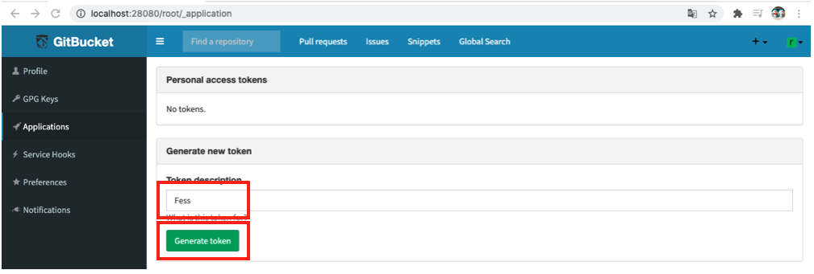 -->


### <u>リポジトリの作成</u>
クローリングのテスト用に適当なリポジトリを作成してください。

## 設定(Fess側)
"localhost:18080"のURLにブラウザでアクセスして管理者(admin)としてログインしてください。<br>
DockerのFessであれば、初期パスワードは"admin"となっています。
なお、初回ログイン時にパスワードの変更を求められます。<br>
<br>
<!-- 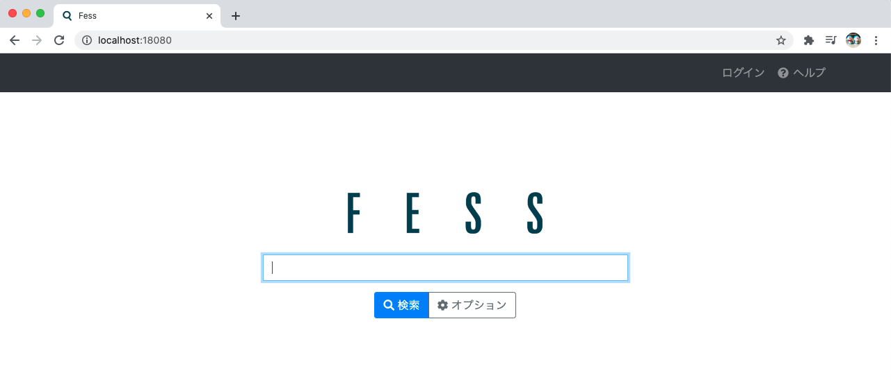 -->


### <u>Gitbucket関連のプラグインをインストール</u>
管理画面からGitbucketを使用するためのプラグインを導入します。<br>
図の様にプルダウンから"fess-ds-gitbucket-13.10.0"を選択してインストールしてください。<br>
<br>
<!-- 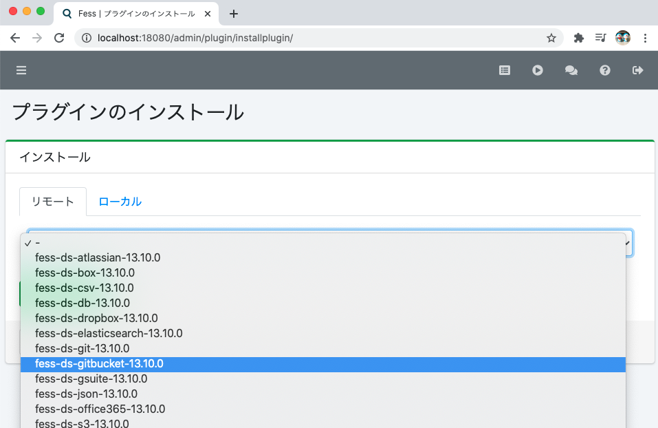 -->

<br>
正常にインストールできたら以下の様に追加されています。ここでGitbucketで生成したトークンを使用します。<br>

<!-- 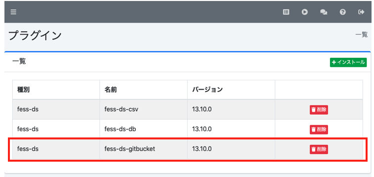 -->


### <u>データストアのクローラ設定</u>
クローリングの設定を行います。データストアを選択して新規作成から作成します。<br>
<br>
<!-- 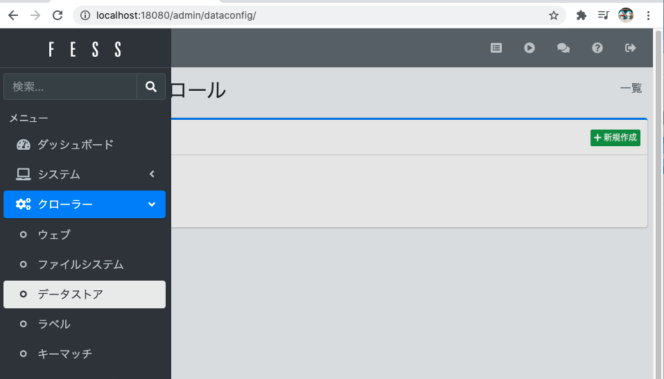 -->

<br>
下図のように設定してください。<br>

<!-- 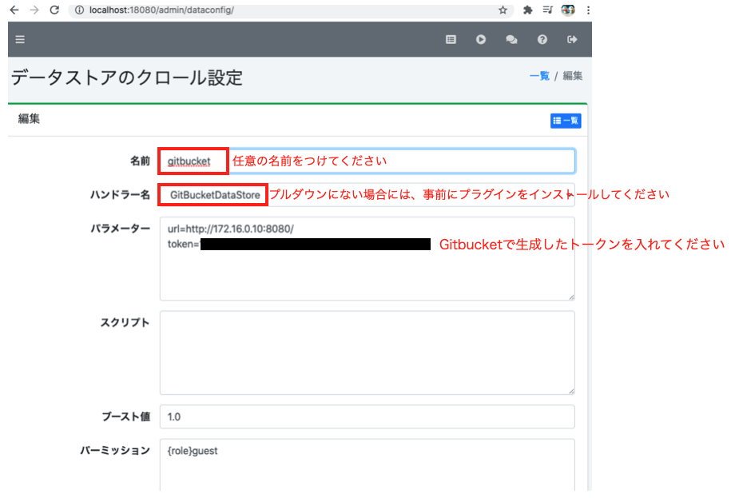 -->


### <u>ジョブの作成</u>
<!--  -->

<br>
"新しいジョブの作成"からジョブを作成してください。作成する際は全ての設定は初期のままで大丈夫です。<br>

<!-- 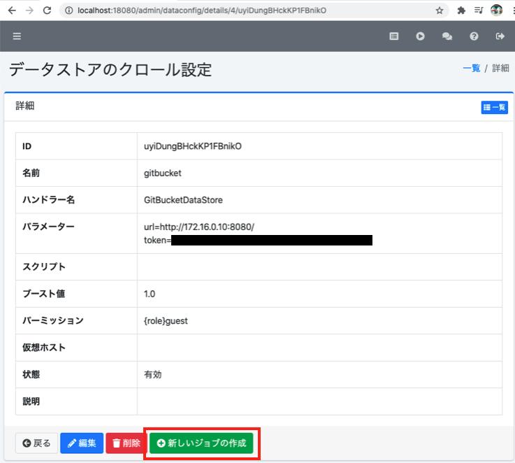 -->


### <u>ジョブの実行</u>
"システム -> スケジューラ"から作成したジョブを選択して実行してください。<br>
<br>
<!-- 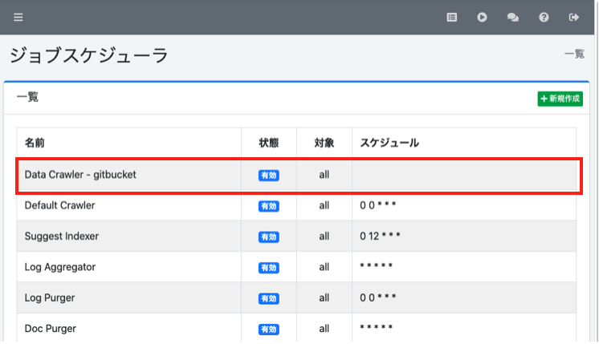 -->


### <u>結果の確認</u>
正常にクローリングができていれば以下の様に検索結果が表示されます。<br>
<br>
<!-- 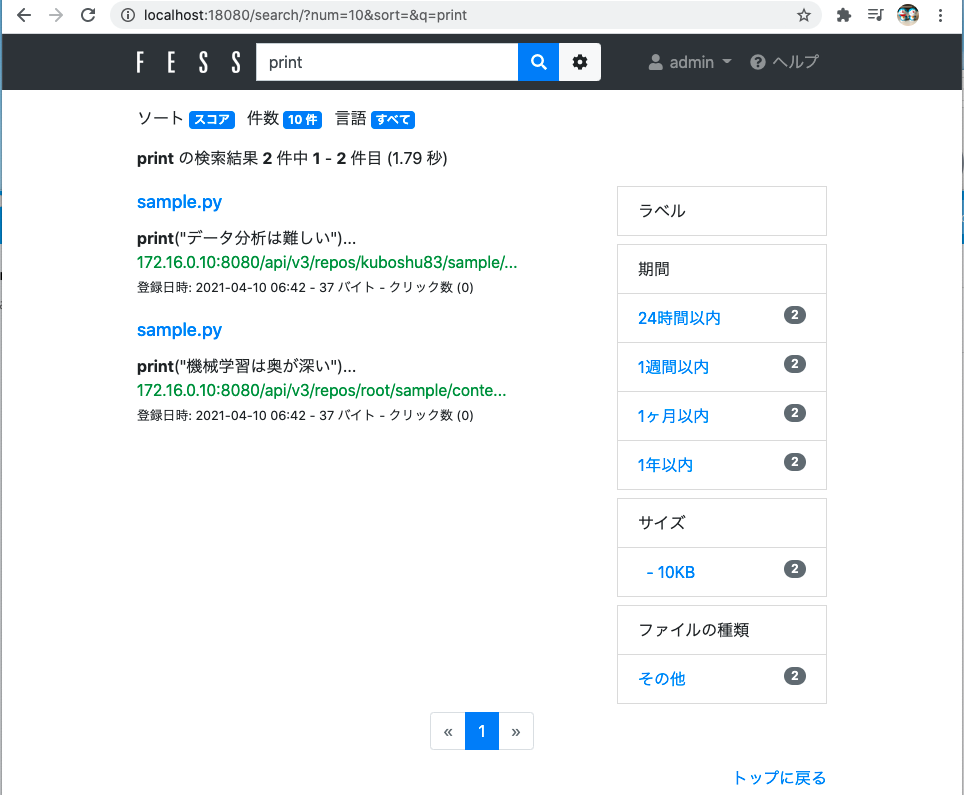 -->


# Redmineのクローリング

## 基本操作

### <u>起動</u>
```
host> docker-compose -f docker-compose.yml -f docker-compose.redmine.yml up -d --build
```

### <u>停止</u>
```
host> docker-compose -f docker-compose.yml -f docker-compose.redmine.yml down
```

### <u>状態確認</u>
```
host> docker-compose -f docker-compose.yml -f docker-compose.redmine.yml ps 
```

## 設定(Redmine側)
Redmine側の設定を行います。

### <u>REST APIの有効化</u>
管理からREST APIを有効にします。<br>
<br>
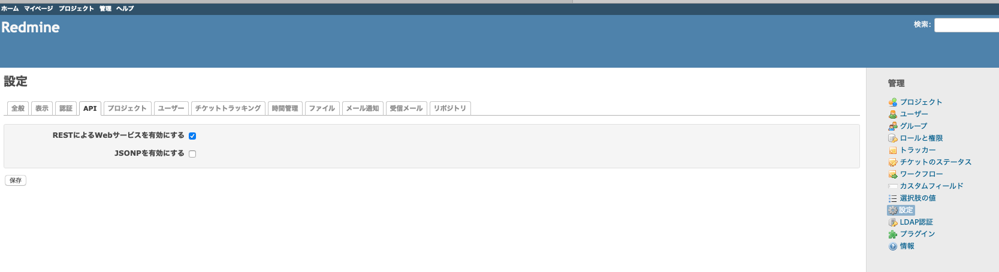

## 設定(Fess側)
Fess側の設定を行います。

### <u>クローリングを設定</u>
以下の様にクローリングの設定を行います。<br>
<br>
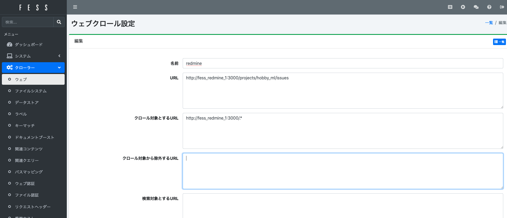


### <u>Web認証の設定</u>
Redmineにアクセスするための認証設定を以下の様に行います。<br>
<br>
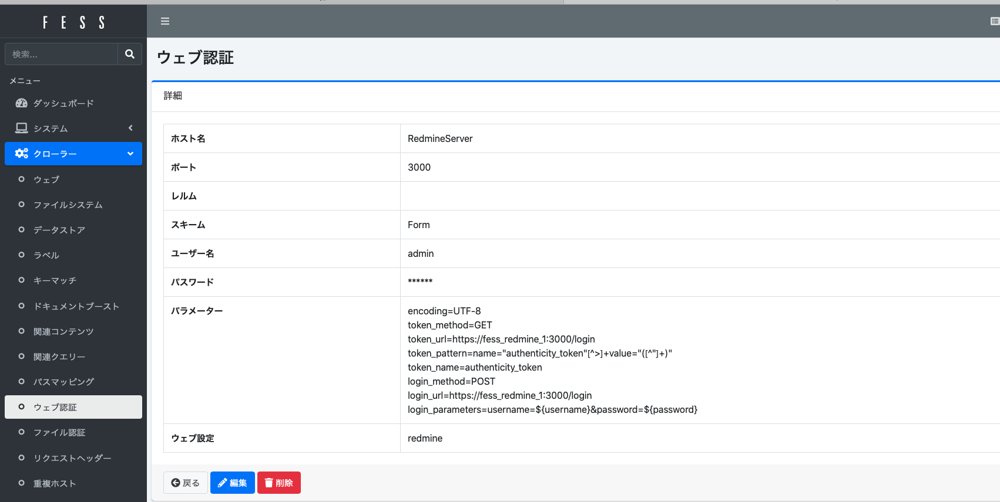

### <u>ジョブの作成と実行</u>
ジョブの作成と実行方法はGitbucketの場合と同じです。

### <u>結果の確認</u>
正常にクローリングできていたら、以下の様にRedmineのチケットが表示されます。<br>
<br>
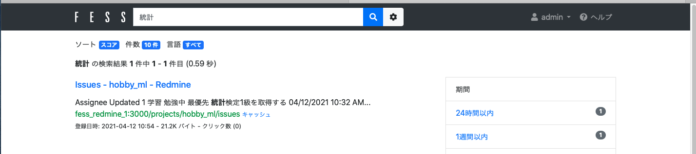

# ローカルファイルシステムのクローリング

## 基本操作
### <u>起動</u>
```
host> docker-compose up -d --build
```

### <u>停止</u>
```
host> docker-compose down
```

### <u>状態確認</u>
```
host> docker-compose ps 
```

## 設定
ファイルシステムへのクローリングを以下の様に設定します。<br>
<br>


### <u>結果の確認</u>
正常にクローリングできていたら、以下の様にローカルに保存されているドキュメントが表示されます。<br>
<br>
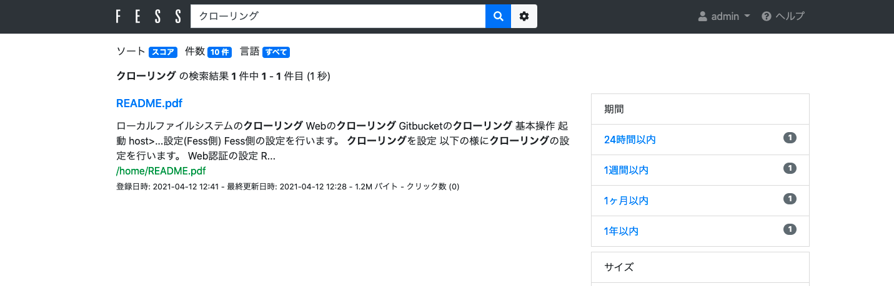
