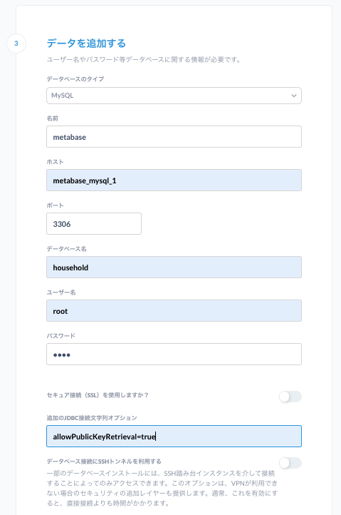
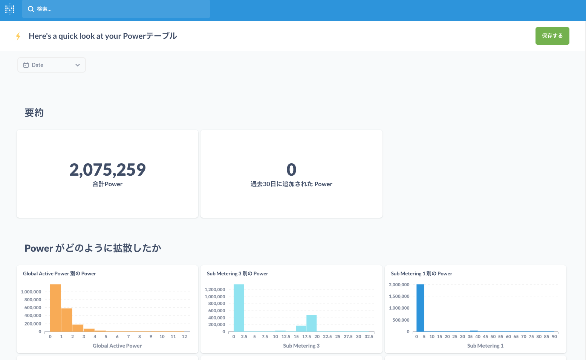

# Metabaseの練習環境
Metabaseの使い方を勉強するための環境です。metabaseサーバとmysqlサーバの２つのコンテナで構成されており、データをMySQL側に登録してMetabase側からデータベースを参照します。


# 注意

- この環境はMetabaseの操作を体験するためだけの使用を想定しており、パフォーマンスやセキュリティの事は一切考慮していませんので、勉強以外の目的で使用しないでください。

- データの永続化はしていないので、コンテナ上で行った内容はコンテナ停止と共に削除されます。

# 使い方

説明する際のプロンプトは、ホスト側での操作の時は"host> "、serverコンテナ側では"server> "、clientコンテナ側では"client> "で表示してます。

## 0. データをダウンロードする
[UCI Machine Learning Repository(Individual household electric power consumption)](https://archive.ics.uci.edu/ml/datasets/Individual+household+electric+power+consumption)からデータをダウンロードして、以下のtxtファイルをcontents/に配置します。

- household_power_consumption.txt

配置しましたら、reform.pyを実行してデータファイル中の日付表示をMySQLが読み取れる形式に変換してください。
具体的な処理を知りたい場合はreform.pyのコードを参照してください。

```bash
host> python reform.py #Python3.6以上での実行を想定しています。(作者環境は3.8.6)
```

### 1. コンテナを起動する
```base
host> docker-compose -d --build
```

### 2. Metabaseを使う

1. ホスト側から起動したブラウザのURLに"localhost:3000"と入力してMetabaseに接続する。<br>
   接続したら案内に従って必要事項を設定していきます。

2. ユーザ情報を入力してください。<br>
   コンテナを停止したら設定は全て消えるので適当に設定します。

3. データベースと接続するために以下の様に入力してください。<br>
   名前は適当で大丈夫です。また、パスワードは"root"です。<br>
   それ以外は、今回はとりあえず初期値で大丈夫です。<br>
   

4. 遊ぶ
   設定に問題がなければMetabaseにデータが読み込まれて以下のように表示されます。<br>
   後はSQLで遊んだり、ダッシュボードを設定したりして遊べます!!
   

5. 使い終わったらブラウザを閉じる

### 3. コンテナ停止
```bash
host> docker-compose down
```

# 勉強会のメンバーへ

- この環境を使って何か得られた知見(操作方法のコツ等)がありましたら、簡単でいいので共有してくれると助かります!!

- この環境に関して要望がありましたらご連絡いただければと思います。

# 参考
- [Metabase](https://www.metabase.com)
- [UCI Machine Learning Repository(Individual household electric power consumption)](https://archive.ics.uci.edu/ml/datasets/Individual+household+electric+power+consumption) 