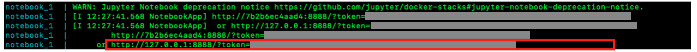
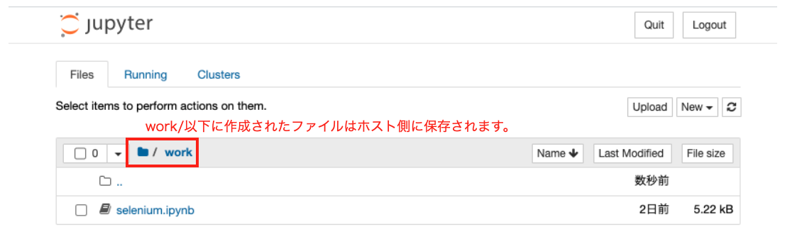

# Seleniumの練習環境
Seleniumの使い方を勉強するための環境で、以下の３つのサービスで構成されています。<br>

### 構成(サービス名)

- selenium: ブラウザとそのドライバ、およびリモートウェブドライバで構成されているコンテナです。<br>
  リモートからこのコンテナのリモートウェブドライバに接続してブラウザを操作します。
- web: nginxのコンテナで、seleniumの接続ターゲットです。<br>
  ただ、webのコンテンツは作成していないのでやれる事は少ないです。<br>
- notebook: seleniumを使用するためのJupyter-notebookを提供します。 

nginxにwebコンテンツを作成する事で色々できるようになりますが、その場合nginxのファイルの永続化をしてください。<br>
でないと、作成したコンテンツがコンテナの停止とともに消えてしまいます。

# 注意

- この環境はSeleniumの操作を体験するためだけの使用を想定しており、パフォーマンスやセキュリティの事は一切考慮していませんので、勉強以外の目的で使用しないでください。

- Jupyter-notebook以外のデータの永続化はしていないので、コンテナ上で行った内容はコンテナ停止と共に削除されます。

# 使い方

## Docker composeで起動する。

説明する際のプロンプトは、ホスト側での操作の時は"host> "。

### 1. コンテナを起動する
```base
host> docker-compose -d --build
```

### 2. Jupyter-notebookに接続する
以下のコマンドを実行してください。
```base
host> docker-compose logs | grep http
```
そして、表示されたURLをホストで起動したブラウザに入力してください。<br>


### 3. Jupyter-notebookにコードを書いて実行する。

この環境では、以下のコードでターゲットにアクセスすることができます。

```python
from selenium import webdriver

options = webdriver.ChromeOptions()
options.add_argument("--headless")

driver = webdriver.Remote(
    command_executor='selenium_selenium_1:4444/wd/hub',
    desired_capabilities=options.to_capabilities(),
    options=options,
)

url = ターゲットのURLをここに入れてください。

driver.get(url)
```

Jupyter-notebookのworkディレクトリ以下に作成されたファイルはコンテナを停止させても消える事はありません。
このファイルはホストの./volumes/notebookに保存されています。<br>



### 4. コンテナ停止
Jupyter-notebookの使用が終了したら、コンテナを停止してブラウザを閉じてください。
```bash
host> docker-compose down
```

# 補足

## [Pythonのパッケージのインストール]
Pythonで使用するパッケージをインストールするにはDockerfile-notebookを修正してください。<br>

例えば、matplotlibをインストールする場合、以下の様になっている部分を
```dockerfile
RUN pip install selenium
```
次の様に修正してください。
```dockerfile
RUN pip install selenium matplotlib
```

そして、修正後に次のコマンドを実行して再度ビルドしてください。<br>
もし、コンテナが起動していたらコンテナを停止してからビルドしてください<br>
```bash
host> docker-compose down #コンテナが起動して無い場合は、この操作はスキップしてください。
host> docker-commpose up -d --build
```

# 勉強会のメンバーへ

- この環境を使って何か得られた知見(操作方法のコツ等)がありましたら、簡単でいいので共有してくれると助かります!!

- この環境に関して要望がありましたらご連絡いただければと思います。


# 参考
- [Selenium:Docker](https://github.com/SeleniumHQ/docker-selenium)
- [Selenium:公式ページ](https://www.selenium.dev/)
- [web driver api](https://selenium-python.readthedocs.io/api.html)